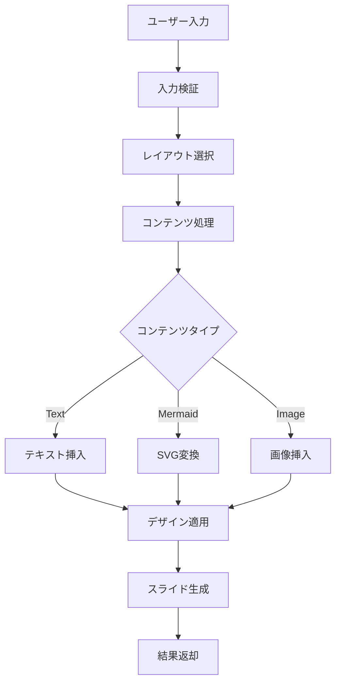
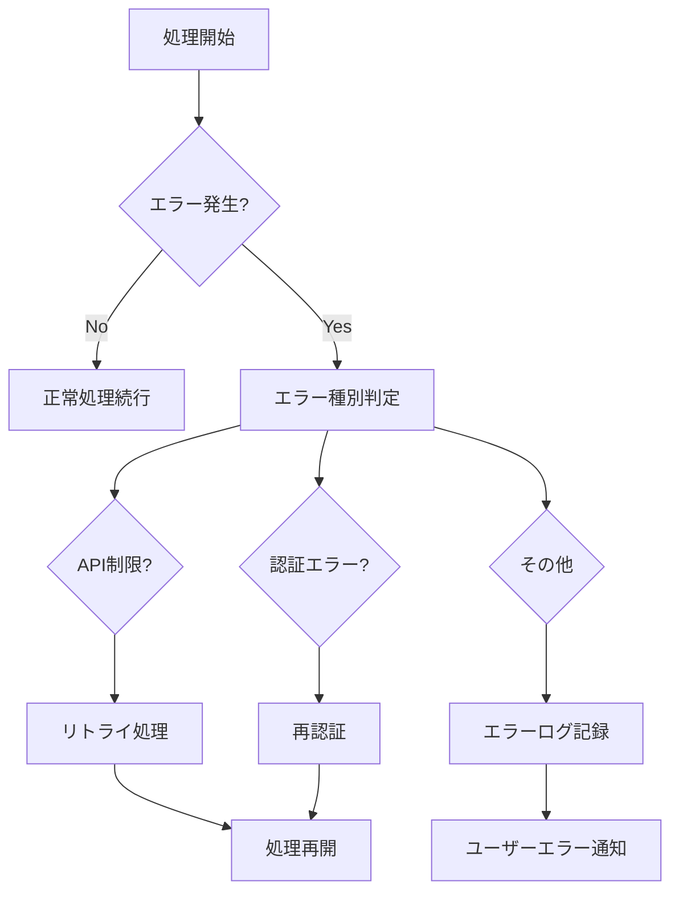

# Google Slides Content Generator - システムアーキテクチャ

## 1. システム概要

### 1.1 アーキテクチャパターン
本システムは **Layer Architecture** を採用し、以下の層で構成される：

```
┌─────────────────────────────────────────────────────────────┐
│                    Presentation Layer                       │
│                  (Web Interface)                            │
├─────────────────────────────────────────────────────────────┤
│                    Application Layer                        │
│                   (Business Logic)                          │
├─────────────────────────────────────────────────────────────┤
│                    Service Layer                            │
│                (Google APIs Integration)                    │
├─────────────────────────────────────────────────────────────┤
│                    Infrastructure Layer                     │
│              (Google Apps Script Runtime)                   │
└─────────────────────────────────────────────────────────────┘
```

## 2. 詳細コンポーネント設計

### 2.1 Presentation Layer
```javascript
// WebApp Interface
class SlideGeneratorUI {
  constructor() {
    this.controller = new SlideController();
  }
  
  // HTML/CSS/JavaScript によるWebインターフェース
  renderForm() { /* ユーザー入力フォーム */ }
  displayProgress() { /* 生成進捗表示 */ }
  showResults() { /* 結果スライド表示 */ }
}
```

### 2.2 Application Layer
```javascript
// メインコントローラー
class SlideController {
  constructor() {
    this.layoutService = new LayoutService();
    this.contentService = new ContentService();
    this.designService = new DesignService();
  }
  
  async generateSlide(request) {
    const layout = this.layoutService.createLayout(request.layoutType);
    const content = await this.contentService.processContent(request.content);
    const design = this.designService.applyTheme(request.theme);
    
    return this.slideService.createSlide(layout, content, design);
  }
}

// レイアウト管理サービス
class LayoutService {
  createLayout(type) {
    switch(type) {
      case 'single-column': return new SingleColumnLayout();
      case 'double-column': return new DoubleColumnLayout();
      default: throw new Error(`Unsupported layout: ${type}`);
    }
  }
}

// コンテンツ処理サービス
class ContentService {
  async processContent(content) {
    if (content.type === 'mermaid') {
      return await this.mermaidProcessor.convertToSVG(content.data);
    }
    return content;
  }
}
```

### 2.3 Service Layer
```javascript
// Google Slides API ラッパー
class GoogleSlidesService {
  constructor() {
    this.slidesApp = SlidesApp;
  }
  
  createPresentation(title) {
    return this.slidesApp.create(title);
  }
  
  addSlide(presentationId, layout) {
    const presentation = this.slidesApp.openById(presentationId);
    return presentation.appendSlide(layout);
  }
  
  insertTextBox(slide, text, position, style) {
    const textBox = slide.insertTextBox(text);
    this.applyTextStyle(textBox, style);
    this.setPosition(textBox, position);
    return textBox;
  }
}

// Mermaid 処理サービス
class MermaidService {
  async convertToSVG(mermaidCode) {
    // Mermaid Live APIを使用してSVG生成
    const response = await this.callMermaidAPI(mermaidCode);
    return response.svg;
  }
  
  async insertMermaidDiagram(slide, mermaidCode, position) {
    const svg = await this.convertToSVG(mermaidCode);
    const tempFile = this.createTempSVGFile(svg);
    const image = slide.insertImage(tempFile.getBlob());
    this.setImagePosition(image, position);
    this.deleteTempFile(tempFile);
    return image;
  }
}
```

## 3. データフロー設計

### 3.1 スライド生成フロー


### 3.2 エラーハンドリングフロー


## 4. レイアウトエンジン設計

### 4.1 レイアウト基底クラス
```javascript
class BaseLayout {
  constructor(slideWidth = 960, slideHeight = 540) {
    this.width = slideWidth;
    this.height = slideHeight;
    this.margin = 60; // 標準余白
  }
  
  calculateContentArea() {
    return {
      width: this.width - (this.margin * 2),
      height: this.height - (this.margin * 2),
      x: this.margin,
      y: this.margin
    };
  }
  
  abstract placeContent(content) {
    throw new Error('Must implement placeContent method');
  }
}

class SingleColumnLayout extends BaseLayout {
  placeContent(content) {
    const area = this.calculateContentArea();
    const itemHeight = area.height / content.length;
    
    return content.map((item, index) => ({
      ...item,
      position: {
        x: area.x,
        y: area.y + (itemHeight * index),
        width: area.width,
        height: itemHeight - 10 // アイテム間余白
      }
    }));
  }
}

class DoubleColumnLayout extends BaseLayout {
  placeContent(content) {
    const area = this.calculateContentArea();
    const columnWidth = (area.width - 20) / 2; // 20px 列間余白
    
    return content.map((item, index) => {
      const column = index % 2;
      const row = Math.floor(index / 2);
      const itemHeight = area.height / Math.ceil(content.length / 2);
      
      return {
        ...item,
        position: {
          x: area.x + (column * (columnWidth + 20)),
          y: area.y + (row * itemHeight),
          width: columnWidth,
          height: itemHeight - 10
        }
      };
    });
  }
}
```

## 5. デザインシステム設計

### 5.1 テーマ管理
```javascript
class ThemeManager {
  constructor() {
    this.themes = {
      'default': new DefaultTheme(),
      'corporate': new CorporateTheme(),
      'creative': new CreativeTheme()
    };
  }
  
  getTheme(themeName) {
    return this.themes[themeName] || this.themes['default'];
  }
}

class BaseTheme {
  constructor() {
    this.fonts = {
      title: { family: 'Arial', size: 44, weight: 'bold' },
      heading: { family: 'Arial', size: 32, weight: 'bold' },
      body: { family: 'Arial', size: 24, weight: 'normal' },
      caption: { family: 'Arial', size: 20, weight: 'normal' }
    };
    
    this.colors = {
      primary: '#1a73e8',
      secondary: '#34a853',
      background: '#ffffff',
      text: '#202124',
      accent: '#fbbc04'
    };
    
    this.spacing = {
      lineHeight: 1.4,
      paragraphSpacing: 16,
      itemSpacing: 12
    };
  }
  
  applyToTextElement(textElement, style = 'body') {
    const font = this.fonts[style];
    textElement.setFontFamily(font.family);
    textElement.setFontSize(font.size);
    textElement.setForegroundColor(this.colors.text);
    
    if (font.weight === 'bold') {
      textElement.setBold(true);
    }
  }
}
```

### 5.2 レスポンシブデザイン
```javascript
class ResponsiveDesign {
  static calculateOptimalSizes(slideWidth, slideHeight, contentAmount) {
    const baseWidth = 960;
    const baseHeight = 540;
    
    const widthRatio = slideWidth / baseWidth;
    const heightRatio = slideHeight / baseHeight;
    const scaleRatio = Math.min(widthRatio, heightRatio);
    
    // コンテンツ量による調整
    const contentFactor = Math.max(0.7, 1 - (contentAmount / 1000) * 0.3);
    
    return {
      titleSize: Math.round(44 * scaleRatio * contentFactor),
      headingSize: Math.round(32 * scaleRatio * contentFactor),
      bodySize: Math.round(24 * scaleRatio * contentFactor),
      margin: Math.round(60 * scaleRatio)
    };
  }
  
  static adjustLineHeight(fontSize) {
    // 小さいフォントほど行間を広く
    if (fontSize < 20) return 1.6;
    if (fontSize < 30) return 1.4;
    return 1.3;
  }
}
```

## 6. パフォーマンス最適化

### 6.1 API呼び出し最適化
```javascript
class APIOptimizer {
  constructor() {
    this.batchSize = 10;
    this.requestQueue = [];
    this.rateLimiter = new RateLimiter(100, 60000); // 100 requests per minute
  }
  
  async batchExecute(operations) {
    const batches = this.chunkArray(operations, this.batchSize);
    const results = [];
    
    for (const batch of batches) {
      await this.rateLimiter.wait();
      const batchResults = await Promise.all(
        batch.map(op => op.execute())
      );
      results.push(...batchResults);
    }
    
    return results;
  }
  
  chunkArray(array, size) {
    const chunks = [];
    for (let i = 0; i < array.length; i += size) {
      chunks.push(array.slice(i, i + size));
    }
    return chunks;
  }
}
```

### 6.2 キャッシュ戦略
```javascript
class CacheManager {
  constructor() {
    this.cache = new Map();
    this.ttl = 300000; // 5分
  }
  
  set(key, value) {
    this.cache.set(key, {
      value,
      timestamp: Date.now()
    });
  }
  
  get(key) {
    const item = this.cache.get(key);
    if (!item) return null;
    
    if (Date.now() - item.timestamp > this.ttl) {
      this.cache.delete(key);
      return null;
    }
    
    return item.value;
  }
  
  generateKey(operation, params) {
    return `${operation}:${JSON.stringify(params)}`;
  }
}
```

## 7. 監視・ログ設計

### 7.1 ログ構造
```javascript
class Logger {
  constructor(level = 'INFO') {
    this.level = level;
    this.levels = { ERROR: 0, WARN: 1, INFO: 2, DEBUG: 3 };
  }
  
  log(level, message, context = {}) {
    if (this.levels[level] <= this.levels[this.level]) {
      const logEntry = {
        timestamp: new Date().toISOString(),
        level,
        message,
        context,
        sessionId: this.getSessionId()
      };
      
      console.log(JSON.stringify(logEntry));
      this.writeToSheet(logEntry); // Spreadsheet にログ保存
    }
  }
  
  error(message, context) { this.log('ERROR', message, context); }
  warn(message, context) { this.log('WARN', message, context); }
  info(message, context) { this.log('INFO', message, context); }
  debug(message, context) { this.log('DEBUG', message, context); }
}
```

## 8. セキュリティアーキテクチャ

### 8.1 認証・認可フロー
```javascript
class SecurityManager {
  constructor() {
    this.permissions = new PermissionManager();
    this.sanitizer = new InputSanitizer();
  }
  
  validateRequest(request, user) {
    // 入力検証
    const sanitizedRequest = this.sanitizer.sanitize(request);
    
    // 権限チェック
    if (!this.permissions.hasAccess(user, sanitizedRequest.action)) {
      throw new SecurityError('Access denied');
    }
    
    return sanitizedRequest;
  }
  
  encryptSensitiveData(data) {
    // 機密データの暗号化
    return Utilities.base64Encode(data);
  }
}
```

このアーキテクチャにより、拡張可能で保守性の高いGoogle Slidesコンテンツ生成サービスを構築できます。