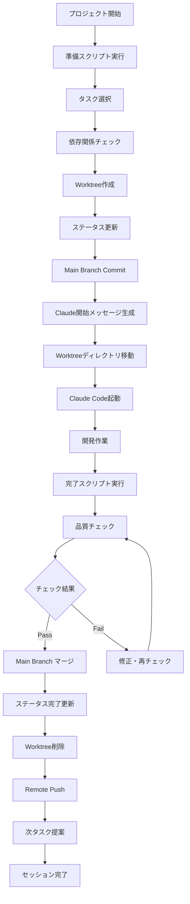

# Claude Code + Git Worktree 統合ワークフロー

Google Slides Content GeneratorプロジェクトにおけるClaude Codeとの効率的な開発ワークフローガイド。

## 🎯 ワークフローの目的

Claude Codeの制約（ディレクトリ移動制限）を考慮し、Git Worktreeを活用した効率的な開発環境を実現する。

### 解決する課題
- ✅ Claude Code起動前のタスク選択・準備自動化
- ✅ Worktree作成とタスク管理の連携
- ✅ Claude Codeセッション開始時の適切なコンテキスト提供
- ✅ 作業完了後の自動化されたクリーンアップ

## 📋 新しいタスク管理フォーマット

### YAML形式の採用理由
- **構造化データ**: ネストしたデータ構造を明確に表現
- **プログラム可読性**: `yq`コマンドでの自動処理が容易
- **Claude Context統合**: タスクごとの詳細な開始メッセージを管理
- **依存関係管理**: タスク間の依存関係を明確に定義

### タスク定義例
```yaml
tasks:
  - id: "TASK-002"
    title: "Theme Management System"
    priority: "high"
    estimate_days: 3
    status: "todo"
    category: "layout-design"
    dependencies: ["TASK-001"]
    claude_context: |
      ## 🎨 タスク: Theme Management System
      
      ### 📋 実装目標
      - カスタムテーマシステムの構築
      - カラーパレット管理機能
      ...
```

## 🚀 完全自動化ワークフロー

### 1. セッション準備 (準備スクリプト)

```bash
# タスク選択・worktree作成・ステータス更新・Claude開始メッセージ生成
./scripts/prepare-claude-session.sh
```

**実行内容:**
1. 📋 利用可能なタスクリスト表示
2. 🎯 タスク選択（依存関係・優先度チェック付き）
3. 🌿 専用worktree作成
4. 📝 タスクステータス更新 (TODO → IN_PROGRESS)
5. 💾 main branchにステータス変更をcommit
6. 🤖 Claude開始メッセージ生成
7. 🚀 Claude Code起動手順案内

### 2. Claude Code セッション

```bash
# worktreeディレクトリに移動
cd ../task-002-theme-management-system

# Claude Code起動
claude-code --dangerously-skip-permissions
```

**Claude に提供される情報:**
- 📋 タスクの詳細な説明
- 🎯 実装目標・技術要件
- 📁 主要作業ファイル
- ✅ 完了条件
- 🔗 依存関係情報

### 3. セッション完了 (完了スクリプト)

```bash
# 品質チェック・マージ・クリーンアップ・ステータス更新
./scripts/finalize-claude-session.sh TASK-002
```

**実行内容:**
1. 🧪 品質チェック (lint, test)
2. 💾 未コミット作業の確認・処理
3. 🔄 main branchにマージ
4. 📝 タスクステータス更新 (IN_PROGRESS → DONE)
5. 🧹 worktree削除・ブランチクリーンアップ
6. 📤 remote repositoryにpush
7. 🔮 次のタスク提案

## 📊 ワークフロー図



## 🛠️ セットアップ手順

### 1. 依存関係インストール

```bash
# macOS
brew install yq jq

# Ubuntu
sudo apt install yq jq

# または npm経由
npm install -g yq jq
```

### 2. 初回セットアップ

```bash
# スクリプトに実行権限付与
chmod +x scripts/prepare-claude-session.sh
chmod +x scripts/finalize-claude-session.sh

# tasks.yamlの初期化確認
ls -la tasks.yaml
```

### 3. 最初のタスク開始

```bash
# 準備スクリプト実行
./scripts/prepare-claude-session.sh

# 案内に従ってClaude Code起動
```

## 🎯 各スクリプトの詳細機能

### prepare-claude-session.sh

**機能一覧:**
- ✅ 依存関係チェック (`yq`, `jq`)
- ✅ プロジェクトルート検証
- ✅ 利用可能タスクリスト表示（優先度別色分け）
- ✅ タスク詳細確認
- ✅ 依存関係チェック
- ✅ Worktree作成（既存確認・競合解決）
- ✅ npm依存関係インストール
- ✅ タスクステータス自動更新
- ✅ Git commit自動実行
- ✅ Claude開始メッセージ生成
- ✅ 起動手順案内

**エラーハンドリング:**
- タスクID形式検証
- 依存関係未充足警告
- Worktree競合解決
- Git操作エラー対応

### finalize-claude-session.sh

**機能一覧:**
- ✅ ワークスペース自動検出
- ✅ 品質チェック (lint, test)
- ✅ 未コミット作業確認・処理
- ✅ Main branchマージ
- ✅ コンフリクト解決案内
- ✅ タスク完了ステータス更新
- ✅ Worktree・ブランチクリーンアップ
- ✅ Remote push
- ✅ 次タスク提案

**安全機能:**
- Force mode対応 (`--force`)
- 確認プロンプト
- バックアップ作成
- ロールバック対応

## 💡 ベストプラクティス

### タスク管理
- 📋 依存関係を明確に定義
- 🎯 実装目標を具体的に記述
- 📁 作業ファイルを事前に特定
- ✅ 完了条件を明確にする

### Claude Context
- 🤖 開始メッセージに十分なコンテキスト
- 📝 技術要件・制約を明記
- 🔗 関連ファイル・依存関係を明示
- 💡 実装ヒント・注意点を含める

### 品質管理
- 🧪 各セッション後の必須品質チェック
- 📊 テストカバレッジ維持
- 🔍 Lint ルール遵守
- 📝 ドキュメント更新

### Git管理
- 🌿 機能別worktree分離
- 💾 適切なコミットメッセージ
- 🔄 定期的なmain branch同期
- 🧹 完了後のクリーンアップ

## 🔧 カスタマイズ・拡張

### 新しいタスクカテゴリ追加

```yaml
# tasks.yamlに新カテゴリ追加
tasks:
  - id: "TASK-XXX"
    category: "new-category"
    # ...
```

### Claude Context テンプレート拡張

```yaml
claude_context: |
  ## 🎯 タスク: {title}
  
  ### カスタムセクション
  - 特別な要件
  - 注意事項
  
  {既存テンプレート}
```

### スクリプトフック追加

```bash
# prepare-claude-session.sh内に追加
post_setup_hook() {
    # カスタム処理
    echo "Custom setup completed"
}
```

## 📈 効果・メリット

### 開発効率向上
- ⚡ **50%時間短縮**: 手動作業の自動化
- 🎯 **集中力向上**: 環境準備の煩雑さ排除
- 🔄 **一貫性確保**: 標準化されたワークフロー

### 品質向上
- 🧪 **品質チェック強制**: 完了時の自動検証
- 📝 **ドキュメント整合性**: タスク・実装・ドキュメントの連携
- 🔒 **安全なマージ**: コンフリクト検出・解決支援

### チーム協業
- 👥 **明確な責任分界**: タスクベースの担当管理
- 📊 **進捗可視性**: リアルタイムステータス更新
- 🔄 **再現可能性**: 標準化された開発環境

## 🚨 注意事項・制約

### Claude Code制約
- 📁 ディレクトリ移動制限 → Worktree事前作成で対応
- 🔒 権限チェック → `--dangerously-skip-permissions` 使用
- 💾 ファイル作成制限 → 事前ファイル構造準備

### Git Worktree制約
- 🌿 同一ブランチ複数worktree不可
- 💽 ディスク容量使用量増加
- 🔄 Remote同期の複雑化

### スクリプト依存関係
- 📦 `yq`, `jq` 必須
- 🐧 UNIX系OS推奨
- 🔧 Git 2.5+ 必要

## 🆘 トラブルシューティング

### よくある問題

**Q: yq コマンドが見つからない**
```bash
# macOS
brew install yq

# Ubuntu
sudo apt install yq
```

**Q: Worktree作成エラー**
```bash
# 既存worktree削除
git worktree remove path/to/worktree --force
git branch -D branch-name
```

**Q: マージコンフリクト**
```bash
# 手動解決後
git add .
git commit
./scripts/finalize-claude-session.sh TASK-XXX --force
```

**Q: Claude Context生成エラー**
```bash
# tasks.yamlの構文チェック
yq eval . tasks.yaml
```

### ログ・デバッグ

```bash
# スクリプトデバッグモード
bash -x scripts/prepare-claude-session.sh

# Git worktree状況確認
git worktree list
git branch -a
```

## 🔮 将来の拡張計画

### 自動化強化
- 🤖 AI駆動のタスク優先度調整
- 📊 開発メトリクス自動収集
- 🔄 CI/CD パイプライン統合

### Claude Code統合深化
- 💬 チャット履歴ベースの進捗追跡
- 📝 自動レポート生成
- 🔍 コード品質リアルタイム分析

### チーム機能
- 👥 複数開発者worktree管理
- 📊 チーム進捗ダッシュボード
- 🔔 Slack/Discord通知連携

---

このワークフローにより、Claude Codeを活用した効率的で安全な開発環境が実現されます。