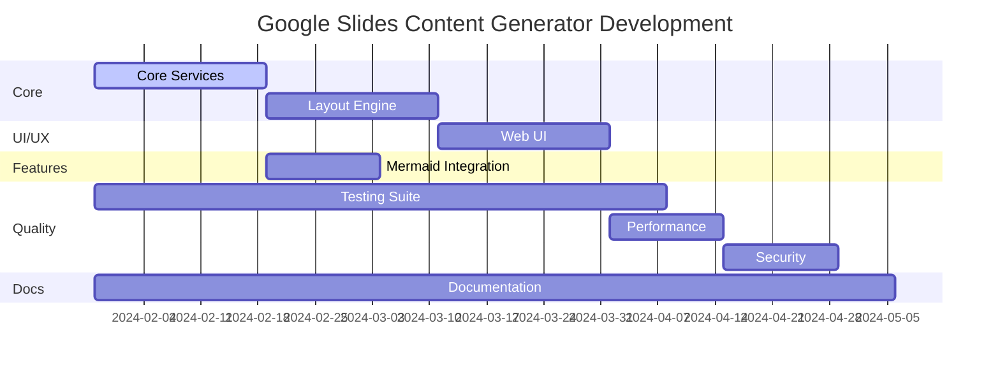

# 開発ロードマップ

## フェーズ別開発計画

### Phase 1: 基盤構築 (Week 1-4) ✅ 完了
- [x] プロジェクト設計・アーキテクチャ策定
- [x] 技術仕様書・ガイドライン作成
- [x] 開発環境・CI/CD構築
- [x] git worktree戦略策定

### Phase 2: コア機能実装 (Week 5-10)

#### 2.1 Core Services Layer (Week 5-7) 🔄 準備中
**担当**: Core Services Team
**Worktree**: `../slide-maker-core-services`
**Branch**: `feature/core-services`

**実装内容**:
```javascript
// 優先度: 高
src/services/slides.js      // Google Slides API wrapper
src/services/content.js     // コンテンツ管理
src/utils/logger.js         // ログシステム  
src/utils/validation.js     // 入力検証
```

**マイルストーン**:
- [ ] Week 5: Google Slides API基本操作実装
- [ ] Week 6: エラーハンドリング・ログ機能
- [ ] Week 7: バリデーション・テスト完成

#### 2.2 Layout Engine (Week 6-8) 🔄 準備中  
**担当**: Layout Team
**Worktree**: `../slide-maker-layout`
**Branch**: `feature/layout-engine`

**実装内容**:
```javascript
// 優先度: 高 (Core Services完了後)
src/utils/design.js         // デザイン計算
src/services/layout.js      // レイアウト管理
```

**マイルストーン**:
- [ ] Week 6: グリッドシステム基盤
- [ ] Week 7: レスポンシブデザイン計算
- [ ] Week 8: テーマシステム実装

#### 2.3 Web UI (Week 8-10) 🔄 準備中
**担当**: Frontend Team  
**Worktree**: `../slide-maker-ui`
**Branch**: `feature/web-ui`

**実装内容**:
```javascript
// 優先度: 中 (Core Services + Layout完了後)
src/web/index.html          // メインUI
src/web/style.css           // スタイルシート
src/web/script.js           // クライアントロジック
src/main.js                 // UI統合
```

**マイルストーン**:
- [ ] Week 8: 基本UI実装
- [ ] Week 9: フォーム処理・バリデーション
- [ ] Week 10: レスポンシブ・UX改善

### Phase 3: 高度機能実装 (Week 11-14)

#### 3.1 Mermaid Integration (Week 11-12) 🔄 準備中
**担当**: Integration Team
**Worktree**: `../slide-maker-mermaid`  
**Branch**: `feature/mermaid-integration`

**実装内容**:
```javascript
// 優先度: 中
src/services/mermaid.js     // Mermaid→SVG変換
```

**マイルストーン**:
- [ ] Week 11: 外部API統合・SVG変換
- [ ] Week 12: エラーハンドリング・最適化

#### 3.2 Comprehensive Testing (Week 5-14) 🔄 継続
**担当**: QA Team
**Worktree**: `../slide-maker-testing`
**Branch**: `test/comprehensive-suite`

**実装内容**:
```javascript
// 優先度: 中 (全期間並行)
tests/unit/*                // 単体テスト
tests/integration/*         // 統合テスト  
tests/e2e/*                 // E2Eテスト
```

**マイルストーン**:
- [ ] Week 5-7: Core Services テスト
- [ ] Week 8-10: Layout Engine テスト
- [ ] Week 11-12: UI・統合テスト
- [ ] Week 13-14: E2Eテスト・カバレッジ向上

### Phase 4: 品質向上・本番準備 (Week 15-18)

#### 4.1 Performance Optimization (Week 15-16) 🔄 準備中
**担当**: Performance Team
**Worktree**: `../slide-maker-performance`
**Branch**: `refactor/performance-optimization`

**実装内容**:
- API呼び出し最適化
- キャッシュメカニズム実装
- バッチ処理改善
- メモリ使用量最適化

#### 4.2 Security Hardening (Week 16-17) 🔄 準備中
**担当**: Security Team
**Worktree**: `../slide-maker-security`
**Branch**: `refactor/security-hardening`

**実装内容**:
- 入力サニタイゼーション強化
- OAuth スコープ最適化
- セキュリティテスト実装
- 脆弱性修正

#### 4.3 Documentation & Release Prep (Week 17-18) 🔄 準備中
**担当**: Documentation Team
**Worktree**: `../slide-maker-docs`
**Branch**: `docs/maintenance`

**実装内容**:
- API仕様書完成
- ユーザーマニュアル作成
- デプロイメントガイド
- トラブルシューティング

### Phase 5: 将来機能・拡張 (Week 19+)

#### 5.1 Spreadsheet Integration 🔄 Future
**担当**: Integration Team Extended
**Worktree**: `../slide-maker-sheets`
**Branch**: `feature/spreadsheet-integration`

**実装内容**:
- Google Sheets API統合
- 動的テーブル・グラフ生成
- 自動更新機能
- データ可視化強化

## 並行開発スケジュール



## リリーススケジュール

### Alpha Release (Week 10)
- Core Services完成
- 基本UI動作
- 単体テスト完了

### Beta Release (Week 14)  
- 全主要機能完成
- 統合テスト完了
- パフォーマンス最適化

### Production Release (Week 18)
- セキュリティ監査完了
- ドキュメント完成
- 本番環境デプロイ

## 継続的メンテナンス

### 日次
- 各worktreeでの開発進捗
- 自動テスト実行・結果確認
- コードレビュー

### 週次  
- worktree統合・競合解決
- パフォーマンス監視
- セキュリティチェック

### 月次
- 依存関係更新
- セキュリティ監査
- パフォーマンス最適化見直し

## リスク管理

### 技術的リスク
- **Google API制限**: レート制限・クォータ監視
- **パフォーマンス**: 大容量データ処理最適化
- **互換性**: ブラウザ・GAS環境互換性

### プロジェクトリスク
- **スケジュール遅延**: worktree並行開発で対応
- **品質問題**: 継続的テスト・レビューで対応
- **リソース不足**: タスク優先度調整で対応

## 成功指標 (KPI)

### 開発指標
- [ ] Code Coverage: 80%以上
- [ ] Build Success Rate: 95%以上  
- [ ] PR Merge Time: 24時間以内

### パフォーマンス指標
- [ ] スライド生成時間: 5秒以内
- [ ] API エラー率: 1%以下
- [ ] レスポンス時間: 2秒以内

### 品質指標
- [ ] Critical Bug: 0件
- [ ] Security Vulnerability: 0件
- [ ] User Satisfaction: 4.5/5以上

この ロードマップに従って、効率的かつ高品質な開発を進めていきます。