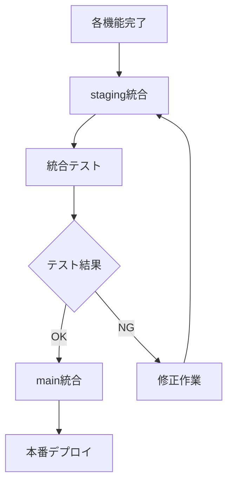

# Git Worktree 分散開発戦略

## 概要

Google Slides Content Generator プロジェクトでのgit worktreeを活用した分散開発計画。各機能を独立したworktreeで並行開発し、競合を最小化しながら効率的な開発を実現する。

## ブランチ戦略

### メインブランチ
- `main` - 本番環境 (プロダクション)
- `develop` - 開発統合ブランチ
- `staging` - ステージング環境

### 機能ブランチパターン
- `feature/*` - 新機能開発
- `refactor/*` - リファクタリング
- `docs/*` - ドキュメント更新
- `test/*` - テスト実装
- `maintenance/*` - メンテナンス作業
- `hotfix/*` - 緊急修正

## Worktree 設定一覧

### 1. 🏗️ Core Services Implementation
```bash
# ブランチ: feature/core-services
# ディレクトリ: ../slide-maker-core-services
git worktree add ../slide-maker-core-services feature/core-services
```

**対象ファイル**:
- `src/services/slides.js`
- `src/services/layout.js` 
- `src/services/content.js`
- `src/utils/logger.js`
- `src/utils/validation.js`

**担当範囲**:
- Google Slides API ラッパーサービス
- 基本的なコンテンツ管理機能
- ログ・バリデーション機能
- エラーハンドリングの基盤

**期間**: 2-3週間
**優先度**: 高 (他の機能の基盤)

---

### 2. 🎨 Layout Engine Implementation  
```bash
# ブランチ: feature/layout-engine
# ディレクトリ: ../slide-maker-layout
git worktree add ../slide-maker-layout feature/layout-engine
```

**対象ファイル**:
- `src/utils/design.js`
- `src/services/layout.js` (拡張)
- レイアウト関連のユーティリティ

**担当範囲**:
- レスポンシブデザイン計算
- グリッドシステム実装
- フォント・余白の自動計算
- テーマシステムの実装

**期間**: 2-3週間  
**優先度**: 高
**依存**: Core Services完了後

---

### 3. 🖼️ Mermaid Integration
```bash
# ブランチ: feature/mermaid-integration
# ディレクトリ: ../slide-maker-mermaid
git worktree add ../slide-maker-mermaid feature/mermaid-integration
```

**対象ファイル**:
- `src/services/mermaid.js`
- 外部API統合ロジック

**担当範囲**:
- Mermaid→SVG変換API統合
- 一時ファイル管理
- 図表挿入ロジック
- エラーハンドリング

**期間**: 1-2週間
**優先度**: 中
**依存**: Core Services完了後

---

### 4. 🌐 Web UI Implementation
```bash
# ブランチ: feature/web-ui
# ディレクトリ: ../slide-maker-ui
git worktree add ../slide-maker-ui feature/web-ui  
```

**対象ファイル**:
- `src/web/index.html`
- `src/web/style.css`
- `src/web/script.js`
- `src/main.js` (UI連携部分)

**担当範囲**:
- ユーザーインターフェース
- フォーム処理・バリデーション
- プログレス表示
- レスポンシブデザイン

**期間**: 2-3週間
**優先度**: 中
**依存**: Core Services + Layout Engine

---

### 5. 🧪 Comprehensive Testing
```bash
# ブランチ: test/comprehensive-suite
# ディレクトリ: ../slide-maker-testing
git worktree add ../slide-maker-testing test/comprehensive-suite
```

**対象ファイル**:
- `tests/unit/*`
- `tests/integration/*`
- `tests/e2e/*`
- `tests/runner.js` (拡張)

**担当範囲**:
- 単体テストの実装
- 統合テストの実装
- E2Eテストシナリオ
- テストカバレッジ向上

**期間**: 継続的 (各機能実装と並行)
**優先度**: 中
**依存**: なし (並行開発可能)

---

### 6. 📊 Performance Optimization
```bash
# ブランチ: refactor/performance-optimization
# ディレクトリ: ../slide-maker-performance
git worktree add ../slide-maker-performance refactor/performance-optimization
```

**対象ファイル**:
- 全ソースファイル (パフォーマンス改善)
- キャッシュ機能追加
- API呼び出し最適化

**担当範囲**:
- API呼び出し回数削減
- キャッシュメカニズム実装  
- バッチ処理最適化
- メモリ使用量最適化

**期間**: 1-2週間
**優先度**: 低
**依存**: 基本機能完了後

---

### 7. 🔒 Security Hardening
```bash
# ブランチ: refactor/security-hardening  
# ディレクトリ: ../slide-maker-security
git worktree add ../slide-maker-security refactor/security-hardening
```

**対象ファイル**:
- `src/utils/validation.js` (強化)
- セキュリティ関連ユーティリティ
- 認証・認可ロジック

**担当範囲**:
- 入力サニタイゼーション強化
- OAuth スコープ最適化
- 機密情報ログ除外
- セキュリティテスト

**期間**: 1週間
**優先度**: 中
**依存**: 基本機能完了後

---

### 8. 📖 Documentation Maintenance
```bash
# ブランチ: docs/maintenance
# ディレクトリ: ../slide-maker-docs
git worktree add ../slide-maker-docs docs/maintenance
```

**対象ファイル**:
- `docs/*` (全ドキュメント)
- `README.md`
- `CLAUDE.md`
- API仕様書

**担当範囲**:
- ドキュメント更新・拡充
- API仕様書作成
- チュートリアル作成
- トラブルシューティングガイド

**期間**: 継続的
**優先度**: 低
**依存**: なし (並行開発可能)

---

### 9. 🚀 Production Maintenance
```bash
# ブランチ: maintenance/production-fixes
# ディレクトリ: ../slide-maker-maintenance  
git worktree add ../slide-maker-maintenance maintenance/production-fixes
```

**対象ファイル**:
- 緊急修正が必要なファイル
- 設定ファイル更新
- デプロイメント改善

**担当範囲**:
- 本番環境のバグ修正
- 設定調整・改善
- モニタリング強化
- CI/CD パイプライン改善

**期間**: 必要時
**優先度**: 高 (緊急時)
**依存**: なし

---

### 10. 🔗 Spreadsheet Integration (将来機能)
```bash
# ブランチ: feature/spreadsheet-integration
# ディレクトリ: ../slide-maker-sheets
git worktree add ../slide-maker-sheets feature/spreadsheet-integration
```

**対象ファイル**:
- `src/services/sheets.js`
- スプレッドシート連携ロジック

**担当範囲**:
- Google Sheets API統合
- データ取得・変換機能
- 動的テーブル・グラフ生成
- 自動更新機能

**期間**: 2-3週間
**優先度**: 低 (将来機能)
**依存**: コア機能完了後

## Worktree 管理コマンド

### セットアップスクリプト
```bash
#!/bin/bash
# setup-worktrees.sh

# 基本的なworktreeを作成
git worktree add ../slide-maker-core-services feature/core-services
git worktree add ../slide-maker-layout feature/layout-engine  
git worktree add ../slide-maker-mermaid feature/mermaid-integration
git worktree add ../slide-maker-ui feature/web-ui
git worktree add ../slide-maker-testing test/comprehensive-suite
git worktree add ../slide-maker-docs docs/maintenance

echo "Worktrees created successfully!"
git worktree list
```

### 管理コマンド
```bash
# worktree一覧表示
git worktree list

# worktree削除
git worktree remove ../slide-maker-[name]

# ブランチ統合 (develop へ)
cd ../slide-maker-[name]
git add . && git commit -m "feat: implement [feature]"
git push origin feature/[branch-name]
# GitHub でPR作成

# worktree更新
cd ../slide-maker-[name]
git pull origin develop  # 最新の変更を取得
```

## 開発フロー

### 1. 機能開発フロー


### 2. 統合テストフロー


## 競合回避戦略

### ファイルレベルでの分離
- 各worktreeは異なるファイルセットを担当
- 共通ファイルの変更は事前調整
- 設定ファイルの変更は最小限に

### 統合ポイントの管理
- `develop` ブランチでの定期統合
- CI/CD での自動競合検出
- PR での事前レビュー

### コミュニケーション
- 週次進捗共有
- 共通ファイル変更の事前連絡
- Slack/Discord での リアルタイム調整

## メンテナンススケジュール

### 週次
- 各worktreeの進捗確認
- develop ブランチへの統合
- 競合解決・調整

### 月次
- パフォーマンス測定
- セキュリティチェック
- ドキュメント更新

### リリース前
- 全worktreeの統合
- 包括的テスト実行
- セキュリティ監査

この戦略により、複数の開発者が効率的に並行開発を行い、高品質なプロダクトを継続的にリリースできます。